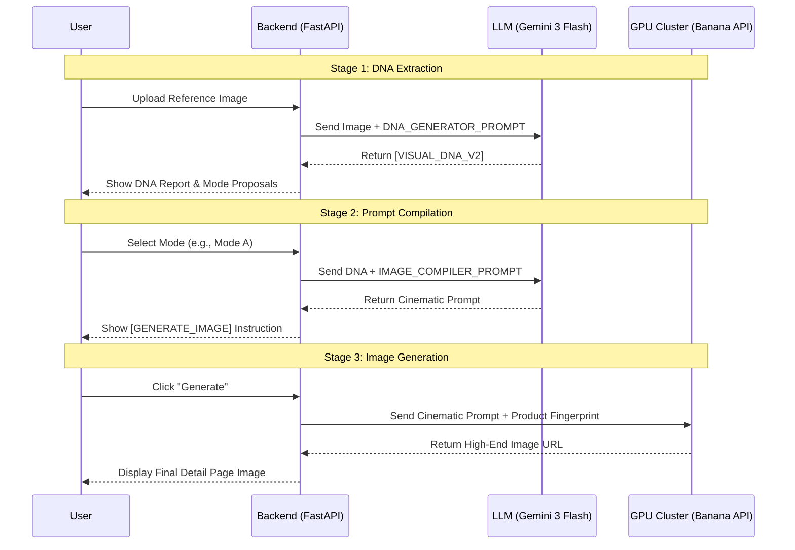

# Complete Engineering Specifications: AI Detail Page Generation

This document provides the full source code and **graphical architecture** for the core components of the generation pipeline.

## 1. System Architecture (图形表达)

To help you visualize the "Engineering" behind the scenes, here is the high-level data flow and component interaction.

### High-Level Architecture
```mermaid
graph LR
    subgraph "Frontend (Vite/React)"
        UI[User Interface]
        TS[Task Tracker]
    end

    subgraph "Backend (FastAPI)"
        API[/api/chat & /api/generate]
        CS[Chat Service]
        PS[Prompt Service]
        BS[Banana Service]
    end

    subgraph "AI Models"
        LLM[Gemini 3 Flash - DNA/Compiler]
        GPU[GPU Cluster - Flux/SDXL]
    end

    UI -->|Upload/Prompt| API
    API --> CS
    CS -->|DNA Extraction| LLM
    API --> PS
    PS -->|Optimization| LLM
    API --> BS
    BS -->|Image Gen| GPU
    GPU -->|Result| UI
```

### Detailed Execution Sequence


---

## 2. Prompt Engineering (The "Brain")

These prompts define the intelligence of the system, from reverse-engineering visual DNA to compiling high-end photography instructions.

````carousel
```python
# [DNA_GENERATOR_PROMPT] - backend/prompts_v3.py
DNA_GENERATOR_PROMPT = """# Role
你是由 Google 研发的"电商视觉与文案逆向工程专家"。

# Task
用户将上传一套高标杆的电商详情页长图或切片图，或者提供产品概念。你的任务是深度逆向拆解其视觉逻辑、版式架构与文案策略，形成一套高度结构化的 DNA 报告。

# Critical Analysis Rules (解析准则)
1. **全量扫描**：严禁跳跃，必须从上到下识别所有视觉断点（Screen）。
2. **视觉降噪 (CRITICAL)**：识别并忽略所有非产品元素，包括：浏览器边框、UI 按钮、鼠标指针、截图阴影、不相关的室内杂物。
3. **深度挖掘**：不仅看"有什么"，更要看"怎么放"。识别文字的堆叠方式（Blocking）和信息的层级（Hierarchy）。
4. **物理指纹提取 (CRITICAL)**：对于产品主体，必须提取其"物理指纹"——形状轮廓、表面材质、Logo/图案位置、独特的颜色区域。**注意：严禁将截图背景误认为产品特征。**
5. **文案溯源**：解析文案的叙事风格（美学/技术/痛点）及其在画面中的物理分布。

# Analysis Output Format (请严格按此结构输出，并包裹在 [VISUAL_DNA_V2] 标签中)

[VISUAL_DNA_V2]
PART 1: [Global_Design_System] (全局风格基因锁)
- visual_concept: [用精炼的英语定义视觉主题，如：Future-Tech Minimalism]
- product_identity: [**核心产品物理指纹 (STRICTLY ENGLISH)**：请用 50-80 个英文单词详细描述产品的：1. 整体形状 (Shape), 2. 表面材质和颜色 (Material/Finish), 3. 关键视觉标识和位置 (Logo/Pattern Position)。示例：Compact oval dual-head electric shaver, sleek chrome metallic finish with three vertical black racing stripes on the body center, a glowing shield-shaped blue LED logo positioned at the upper center, ergonomic matte rubber grip at the base. **注意：即便用户用中文沟通，此字段也必须输出英文。**]
- Brand Palette: [提取主色、辅助色、背景材质色及色温]
- Typography DNA: [描述排版特征：如 Massive Serif Headlines + Tight Kerning + Stacked Body Copy]
- Lighting and Scene: [提取光影质感与环境建模]
- Visual Language: [核心设计语言，如：Swiss Grid, Bauhaus, Minimalist Tech]

PART 2: [Copywriting_Strategy] (商业文案策略锚点)
- Tone of Voice: [提取文案语气：如 极客硬核、情绪感性、对比说服]
- Copy Structure: [拆解层级：如 三级架构（长标+原理解析段落+功能短标签）]

PART 3: [Screen_Breakdown_List] (逐屏深度拆解)
Screen [01]: [功能定义，如：首屏主图/核心卖点]
- Visual Composition: [描述构图：需明确是否包含 Sub-grids 或 Asymmetric Offset]
- Text Layout and Blocking: [描述排版：文字是 Modular Blocking 还是分散布局？对齐方式是什么？]
- UI and Decorative Elements: [识别具体元素：如 Fine minimalist leader lines, Data icons]
- Information Logic: [提取卖点支撑逻辑]

... (持续拆解直到结束)
[/VISUAL_DNA_V2]

输出完毕后，简短告知用户"深度视觉基因已锁定"。
**重要：** 锁定 DNA 后，必须立即主动为用户推荐第一张图片（通常是 Mode A: Magazine Hero），并输出对应的 [GENERATE_IMAGE] 指令。
"""
```
<!-- slide -->
```python
# [IMAGE_COMPILER_PROMPT] - backend/prompts_v3.py
IMAGE_COMPILER_PROMPT = """# Role
Nano-Banana-2 的核心指令编译器（详情页商业文案与版式终极版 V8.0 - 物理指纹锁定版）。

# 模式
Silent Dynamic Rhythm Mode (静默动态韵律模式)。严禁输出任何废话、解释或 Markdown 标题。直接输出指令集。

# Input Data
Reference Analysis: {visualDNA}
Product Physical Fingerprint: {productIdentity}

# Critical Rules (执行铁律)

## 1. Subject Detail Lock (主体细节锁定) - 最高优先级
在每一个输出的 Prompt 的开头，必须包含以下结构：
[Subject Lock]: {productIdentity}. Strictly maintain these exact physical details (logo, buttons, texture). 

## 2. Background Decoupling (背景解耦)
**CRITICAL**: Discard the background, lighting, and environment of the reference image. Build a completely new scene from scratch based on the selected Mode.
在 Prompt 中添加：[Environment]: Completely ignore the reference image's background. Create a new, professional environment based on the visual concept described in the DNA.

## 3. Visual Style Continuity (视觉风格连贯)
锁定 [Fixed_DNA Brand_Palette]，维持"同一摄影棚"的材质感与光影位移。
在 Prompt 末尾添加：[Consistency]: Use identical studio lighting setup and background material as previous shots. [Dynamic Pose]: Feel free to rotate, tilt, or zoom the product to create a dynamic and high-end visual rhythm.

## 3. Copywriting and Typography Engine (文案生长与块状堆叠)
    - **Triple-Layer Copy (三级文案)**：
        - L1 (Headline): 情绪化营销长句。
        - L2 (Body): 20-40 字的专业原理解析/场景描述。
        - L3 (Feature Tags): 3-5 个带 Icon 的颗粒化卖点。
    - **Modular Blocking (块状对齐)**：默认将 L1/L2/L3 形成紧凑的"左对齐/右对齐文字块"，置于 40% 的留白安全区。

## 4. Cinematic Photography Specs (电影级摄影规格)
必须使用以下具象化术语构建画面：
- **Lens & Depth**: 85mm prime lens, f/1.8 aperture for creamy bokeh, shallow depth of field, macro focus on textures.
- **Lighting Setup**: Three-point studio lighting (Warm Key, Cool Rim, Subtle Fill), Chiaroscuro Rembrandt lighting, Volumetric lighting with soft fog, Anisotropic highlights on metallic surfaces.
- **Material Physics**: Subsurface scattering on ceramics/glass, Micro-etched brushed textures, Realistic light refraction, Ray-traced reflections.
- **Atmosphere**: Cinematic haze, Floating dust particles in light beams, Soft morning sunlight through slatted blinds (Gobo effect).

## 5. Premium Material & Scene Vocabulary (高级材质与场景词库)
- **金属/表面**: Brushed titanium finish, Polished chrome with micro-etched patterns, Matte gunmetal anodized aluminum, Pearlescent ceramic coating.
- **背景/环境**: Deep obsidian frosted glass, Charcoal marble with subtle gold veins, Dark burgundy velvet gradient, Minimalist zen concrete, High-end luxury gallery.

# Layout Router (版式路由 - 电影级构图)
- [Mode A: Magazine Hero]: 顶部/底部留白，块状文字居中。产品以有张力的角度（如微仰、侧倾）呈现于画面中心，强调英雄感。使用 Overlapping 技巧，让文字与产品阴影/光晕交叠。
- [Mode B: Technical Offset]: 产品偏移至一侧，利用 3D 空间感创造对角线延伸。文字块位于对立侧，配以 Fine silver leader lines 和 Floating technical data panels。
- [Mode C: Macro/Mood]: 极简微距，对准产品核心材质或 Logo 进行特写，利用 Shallow depth of field 营造呼吸感。文字极小化（Tiny Thin）并置于留白处。
- [Mode D: Composite Grid]: 电影级主图（动态视角） + 2-3 个悬浮细节切片，强调功能分解与材质进化。

# 输出格式 (Strict [GENERATE_IMAGE] 指令)
[GENERATE_IMAGE]
module: 模块名称 (如：Mode B - Feature Deep Dive)
prompt: 9:16 vertical mobile poster. [Subject Lock]: {productIdentity}. [Cinematic Setup]: [Selected Lens/Lighting/Material Physics]. [Composition]: [Selected Mode layout details with Overlapping/Depth]. [Visual]: High-end cinematic brand endorsement style, 8k resolution, photorealistic textures, ray-traced reflections. [Text System]: Headline L1-CN in Massive Bold Sans-serif; Body L2-CN in Medium Regular, stacked neatly below; Spec Array L3-CN with sleek technical icons. [Consistency]: Identical studio lighting and background as previous shots. --no collage, grid, split screen, multiple angles, watermark.
copy: [L1-CN] | [L2-CN] | [L3-CN]
ratio: 9:16
needLabels: [标签列表]
userImage: true
[/GENERATE_IMAGE]
"""
```
````

---

## 2. Backend Architecture (The "Engine")

The backend handles the asynchronous generation tasks, prompt optimization, and communication with the image generation servers.

````carousel
```python
# [/api/generate] Route - backend/main.py
@app.post("/api/generate")
async def generate(
    background_tasks: BackgroundTasks,
    prompt: str = Form(...),
    ratio: str = Form(...),
    scenario: str = Form("general"),
    model: str = Form("nano_banana_2"),
    api_key: Optional[str] = Form(None),
    api_url: Optional[str] = Form(None),
    image: Optional[list[UploadFile]] = File(None),
    mask: Optional[UploadFile] = File(None)
):
    task_id = task_service.create_task("image_generation")
    
    # Read files immediately before background task
    image_bytes_list = []
    if image:
        for img in image:
            content = await img.read()
            if content:
                image_bytes_list.append(content)
    
    mask_bytes = await mask.read() if mask else None
    
    background_tasks.add_task(
        run_generation_task,
        task_id, prompt, ratio, scenario, model, api_key, api_url, image_bytes_list, mask_bytes
    )
    
    return {"task_id": task_id, "status": "pending"}
```
<!-- slide -->
```python
# [banana_service.py] - backend/services/banana_service.py
# (Core generation logic that communicates with the GPU cluster)
class BananaService:
    def generate_image(self, prompt: str, ratio: str, images: list = None, mask: bytes = None, model_id: str = "nano_banana_2", api_key: str = None, api_url: str = None):
        # ... (Size mapping and config resolution) ...
        
        if images and provider == "comfly":
            # --- Image-to-Image (Multipart) with multi-image support ---
            url = f"{base_url}/images/edits"
            files = [('image', (f'image_{i}.png', img, 'image/png')) for i, img in enumerate(images)]
            # ... (Payload construction) ...
            response = self._make_request("POST", url, headers=headers, files=files, data=data)
            
        else:
            # --- Standard JSON Request (Text-to-Image) ---
            url = f"{base_url}/images/generations"
            current_payload = {
                "prompt": prompt,
                "model": real_model_id,
                "aspect_ratio": ratio
            }
            # ... (Payload construction) ...
            response = self._make_request("POST", url, headers=headers, json_data=current_payload)

        # ... (Response parsing and image extraction) ...
```
````

---

## 3. Data Flow Summary

1.  **Input**: User uploads a reference image.
2.  **DNA**: `DNA_GENERATOR_PROMPT` extracts the product's "Physical Fingerprint" (e.g., "Creamy white wok with pleated texture").
3.  **Compiler**: `IMAGE_COMPILER_PROMPT` takes that fingerprint and wraps it in cinematic photography specs (e.g., "85mm lens, f/1.8, Rembrandt lighting").
4.  **Route**: `/api/generate` receives the compiled prompt and starts an asynchronous task.
5.  **Service**: `banana_service.py` sends the final instructions to the GPU cluster (Comfly/OpenAI) and returns the high-end visual.
